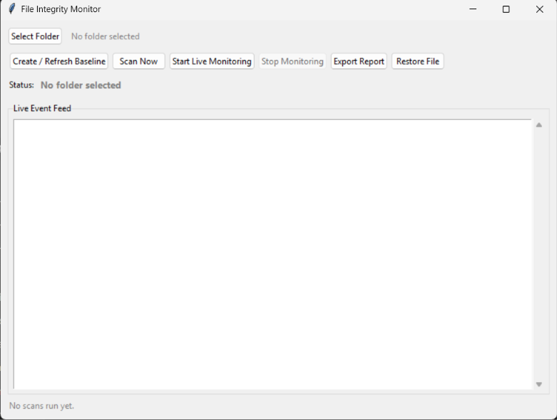
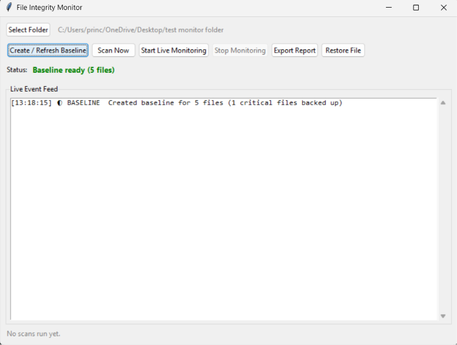
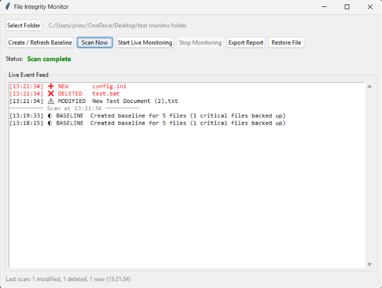
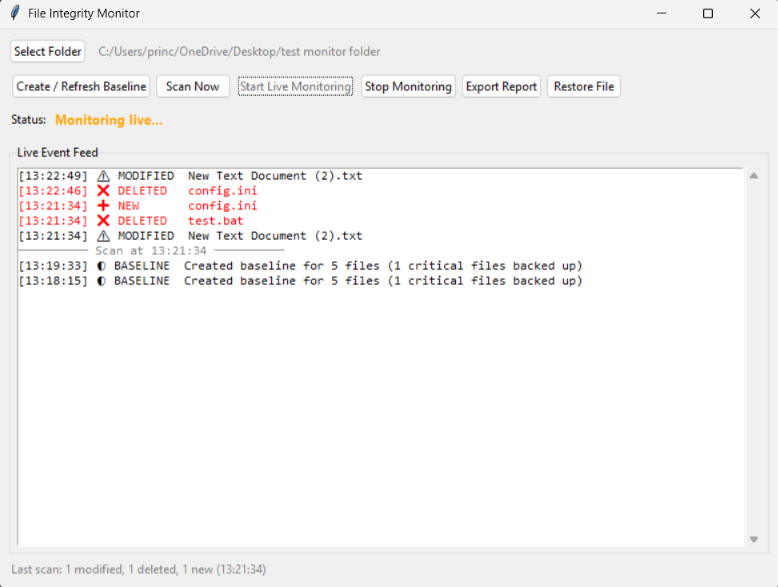

# File Integrity Monitor

A real-time file integrity monitoring tool with a Tkinter GUI, built in Python. It detects file modifications, deletions, and new file creation using SHA-256 hashing, flags critical files for higher-priority alerts, and can automatically back up and restore critical files to their last known-good state.

Built as part of a cybersecurity internship project, with a focus on demonstrating practical defensive ("blue team") security tooling — the kind of monitoring logic used in real endpoint security and intrusion detection systems, scoped down to something buildable and understandable end-to-end.

## Features

- **SHA-256 hashing** of every file in a selected folder (recursive — includes subfolders)
- **Baseline system** — saves a snapshot of "known-good" file states to compare against later
- **One-time scan mode** — manually compare the current folder state to the baseline on demand
- **Live monitoring mode** — uses the `watchdog` library to detect changes in real time, with duplicate-event filtering so a single file save doesn't trigger multiple alerts
- **Critical file tagging** — files with extensions like `.exe`, `.dll`, `.ini`, `.conf`, `.bat`, `.sh` are flagged as critical and shown in red in the event feed
- **Automatic backup** — critical files are backed up at baseline time
- **One-click restore** — recover a critical file's last known-good content if it's modified or deleted
- **Structured logging** — every event is timestamped and saved to a log file for an audit trail
- **Report export** — generate a clean summary report of any scan's results
- **Readable live event feed** — timestamped, icon-tagged, color-coded entries with scan dividers, so events are easy to scan visually rather than reading a wall of identical-looking lines

## How it works

1. **Select a folder** to monitor via the GUI's folder picker.
2. **Create a baseline** — the tool hashes every file in the folder and saves the result to `baseline.json`. At this point, any file matching a critical extension also gets its content copied into a local `backups/` folder.
3. **Detect changes** either by clicking **Scan Now** (one-time comparison against the baseline) or **Start Live Monitoring** (continuous, real-time detection via the OS-level file system watcher).
4. **Review events** in the color-coded feed — black for routine changes, red for critical files.
5. **Restore if needed** — if a critical file was modified or deleted, click **Restore File** and enter its relative path to recover the backed-up version.

> **Note on backups:** backups are only created/refreshed when you click **Create / Refresh Baseline** — not during a scan. If you add a critical file *after* your last baseline, you need to re-baseline before a backup will exist for it.

## Project structure

```
file-integrity-monitor/
├── gui.py                  # Main GUI application (entry point)
├── integrity_engine.py     # Core hashing, baseline creation, and comparison logic
├── monitor.py               # Live, real-time monitoring via watchdog
├── backup_manager.py        # Backup and restore logic for critical files
├── logger.py                 # Structured event logging and report export
├── requirements.txt
├── screenshots/               # Demo screenshots of the GUI in action
└── README.md
```

## Requirements

- Python 3.8+
- Works on Windows, macOS, and Linux (developed and tested on Windows 11)

## Installation

```bash
git clone https://github.com/prince-raj-09/file-integrity-monitor.git
cd file-integrity-monitor
python -m venv venv
venv\Scripts\activate          # On Windows
# source venv/bin/activate     # On macOS/Linux
pip install -r requirements.txt
```

## Usage

```bash
python gui.py
```

Then in the GUI:

1. Click **Select Folder** and choose the folder you want to monitor.
2. Click **Create / Refresh Baseline** to take an initial snapshot (and back up critical files).
3. Use **Scan Now** for a one-time check, or **Start Live Monitoring** for continuous real-time detection.
4. Watch the event feed for alerts — red entries are critical files.
5. Use **Export Report** to save a summary of the last scan, or **Restore File** to recover a critical file from backup.

## Screenshots

**Main interface (idle state)**



**Baseline created**



**Scan detecting changes**



**Live monitoring in action**



## Why these design choices

- **BPF-style separation of concerns** — hashing/baseline logic, live monitoring, backups, and logging are each in their own module, so the codebase is easy to extend (e.g. adding a new alert channel only touches `logger.py`).
- **Duplicate-event filtering** in live mode exists because the underlying `watchdog` library often fires multiple raw filesystem events for what is, from a user's perspective, a single save — without filtering, the feed would be noisy and misleading.
- **Persistent JSON baseline** rather than only an in-memory snapshot, so monitoring state survives between sessions and the tool can be re-run later against the same folder.
- **Backup/restore turns the tool from pure detection into basic recovery**, which is a more complete and practically useful feature set than alerting alone.

## Limitations & possible future improvements

- Critical file detection is extension-based; could be extended to support custom rules or specific filenames.
- No email/SMS alerting (kept out of scope to avoid requiring external credentials/setup) — logging and the GUI feed serve as the alert mechanism for now.
- Backups store only the most recent known-good version, not a full version history.
- Could add a simple authentication layer if this were extended toward multi-user use.

## Disclaimer

This tool is intended for educational and authorized monitoring use only — for example, your own files, your own systems, or systems you have explicit permission to monitor.

## Author

Built by [prince-raj-09](https://github.com/prince-raj-09) as part of a cybersecurity internship project.
